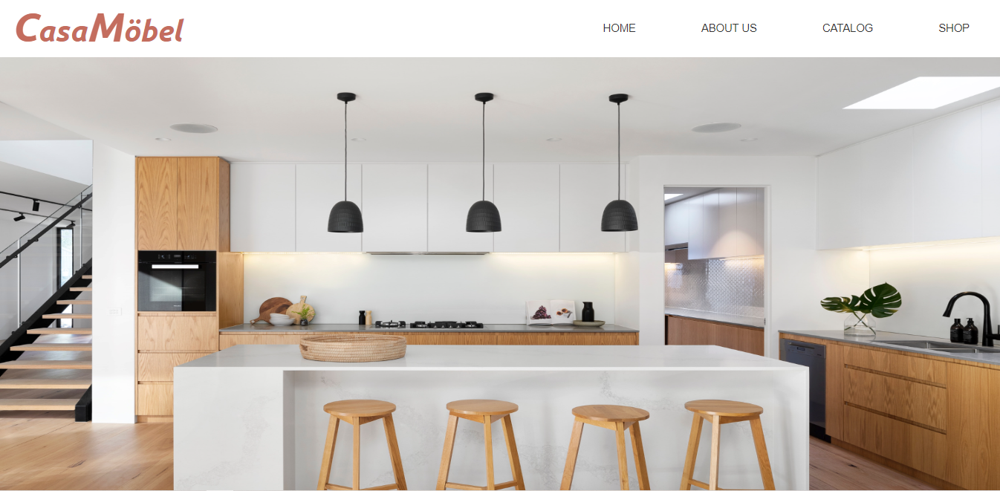

# CasaMöbel

CasaMöbel is a family-owned and operated furniture business and this website was created for the final project of the [Try Kibo Web Foundations](https://kibo.school/classes/web-foundations/) - July 2022 program.

## About

The main focus of CasaMöbel is to create elegant and eco-friendly furniture that has minimal impact on the environment, so they can contribute significantly to the care of our planet.

The CasaMöbel homepage is a basic webpage which was created using the fundamentals of HTML, CSS and JavaScript. This project shows the application of the skills learnt during the course of the Try Kibo program.



## Prerequsites to view this website

### To Clone this Website

- Git installed on your local machine
- A browser e.g Google Chrome

### To View on GitHub Pages

- A browser e.g Google Chrome

## How to View this Website

### On your Local Machine

- Clone this project to your machine using the command on your terminal:

```
git status
git add
git commit
```

- You can also decide to download the zipped file from github instead of cloning the project
- Go to the directory of the project - **CasaMöbel**
- Open up the `index.html` file at the root of the directory in a browser.

### Using GitHub Pages

- On this repository page, look for **Environments**
- Click on **github-pages** which has an _Active_ button beside it.
- This will take you to the Deployments history
- Click **View Deployment**

## Known Bugs

This website is not responsive to smaller screens -yet.

## Contributors

- [Peace Adamson](https://www.linkedin.com/in/peace-adamson/)
- [Ebunoluwa Amoo](https://www.linkedin.com/in/ebunoluwa-amoo-1557a522a/)
- [Ogheneobukome Ejaife](https://www.linkedin.com/in/ogheneobukome-ejaife-64ba0b175/)

## Acknowledgement

I would like to thank all the contributors that worked on this project together, [Ebun](https://www.linkedin.com/in/ebunoluwa-amoo-1557a522a/) and [Jefferson](https://www.linkedin.com/in/ogheneobukome-ejaife-64ba0b175/). Special thanks to [Kibo School](https://kibo.school/) for the opportunity to be a part of their learning community.

## License

Distributed under the [MIT](https://mit-license.org/) License.

link license
copy ssh clone
